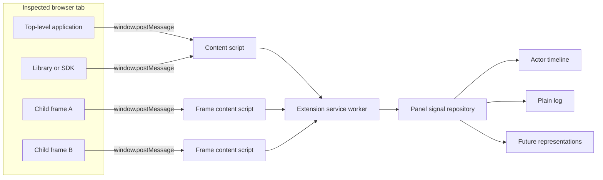

# Koshko Inspector: Technical Requirements

Status: draft  
Intended use: starting point for product design, implementation planning, and task decomposition

## 1. Purpose

Koshko Inspector is an open-source browser extension for inspecting structured koshko signals emitted by
applications running in a browser tab and its frames.

The tool must help a developer answer:

- What happened?
- When did it happen?
- Which logical actor produced the signal?
- Was another actor the target?
- What data was associated with the signal?
- Which signals belong to the same user or application flow?

The initial example is the interaction between a user, a host application, a client SDK, and
embedded application frames. The extension, protocol, storage, and visualizations must not depend
on that example, Vue, React, Svelte, Nano Stores, or a particular application protocol.

## 2. Product principles

1. **One signal model, multiple representations.** Collection and normalization happen once. The
   sequence timeline, plain log, and future views consume the same immutable signals.
2. **Explicit semantic instrumentation.** Small application snippets identify meaningful events.
   The extension must not rely primarily on monkey-patching framework or browser APIs.
3. **Framework neutrality.** Application code communicates through a versioned JSON-compatible
   protocol, not through Vue DevTools, Redux DevTools, or extension internals.
4. **Development-only production integrations.** Instrumentation in production SDKs and widgets
   must be removable by compile-time dead-code elimination.
5. **Local and private by default.** No server, account, analytics, or network export is required.
6. **Safe failure.** An absent extension, invalid signal, serialization failure, or observer error
   must never change application behavior.
7. **Open source.** The extension, protocol, and emitter should use an OSI-approved permissive
   license; MIT is the recommended default.

## 3. Scope

### 3.1 Required for the first release

- Chromium Manifest V3 extension built with WXT.
- Content collection from the inspected top-level page and permitted child frames.
- A dedicated Chrome DevTools panel.
- Actor sequence timeline view.
- Chronological plain log view.
- Expandable structured details.
- Filtering, search, pause/follow, clear, and JSONL export.
- A framework-neutral TypeScript emitter and runtime protocol validator.
- Development-only integration examples for a host application, an SDK, and embedded/processing
  application frames.
- Light and dark themes following the browser DevTools theme.

### 3.2 Explicitly out of scope for the first release

- Production telemetry collection or remote upload.
- Session replay, screenshots, or DOM recording.
- Automatic reconstruction of application semantics from arbitrary `postMessage`, console, or
  network traffic.
- Editing application state or replaying commands into the inspected page.
- Distributed backend tracing.
- Safari support.
- A public production SDK debugging API.

Firefox support is desirable after the Chromium implementation is stable. WXT must be used in a
way that does not unnecessarily prevent that follow-up.

## 4. Terminology

- **Signal:** one immutable structured record describing an observed event.
- **Actor:** a logical participant that can produce or receive signals.
- **Actor instance:** a concrete occurrence of an actor, such as embedded and processing iframes
  that both belong to the same logical widget actor.
- **Source:** actor that produced or initiated the signal.
- **Target:** optional actor to which an action or message is directed.
- **Flow:** related signals grouped by a correlation identifier.
- **Producer:** one JavaScript execution context emitting signals.
- **Representation:** a UI projection over normalized signals, such as the sequence timeline or
  plain log.

## 5. High-level architecture



### 5.1 Extension components

The WXT project must contain these logical entrypoints:

1. **DevTools entrypoint** creates a dedicated `Koshko` panel through
   `chrome.devtools.panels.create`.
2. **Panel application** owns the normalized in-memory signal repository and renders views.
3. **Content script** runs in every permitted frame, validates page messages, enriches them with
   frame metadata, and forwards them to the extension.
4. **Manifest V3 service worker** routes messages by tab and navigation to the connected panel.
5. **Options/onboarding page** manages optional host permissions and explains missing frame access.

The reference panel UI should use React. React is an implementation detail of the extension UI and
must not be required by inspected applications. Application protocol and view models must remain
plain TypeScript.

## 6. Repository/package structure

The preferred open-source layout is:

```text
koshko-inspector/
├── apps/
│   └── extension/             # WXT MV3 extension and React panel
├── packages/
│   ├── protocol/              # Types, JSON Schema, validator, compatibility rules
│   ├── emitter/               # Side-effect-free browser emitter
│   └── test-utils/            # Fixtures and cross-frame test helpers
├── examples/
│   ├── basic-multi-frame/     # Neutral public example
│   └── merchant-widget/       # First real integration pattern
└── docs/
```

The neutral example is mandatory so the project never treats its first integration as the
architectural core.

## 7. Signal protocol

### 7.1 Normalized signal

The canonical protocol must be published as TypeScript types and JSON Schema.

```ts
export interface KoshkoSignalV1 {
    protocol: 'koshko';
    version: 1;
    id: string;
    producerId: string;
    producerSequence: number;
    occurredAt: number;
    source: ActorReference;
    target?: ActorReference;
    name: string;
    severity?: 'debug' | 'info' | 'success' | 'warning' | 'error';
    details?: JsonValue;
    context?: Record<string, string>;
    correlationId?: string;
    causedBy?: string;
    tags?: string[];
}

export interface ActorReference {
    id: string;
    instanceId?: string;
    label?: string;
    instanceLabel?: string;
}
```

Requirements:

- `ActorReference.id` is generic and application-defined.
- `instanceId` distinguishes multiple instances in one actor lane.
- A missing target means an internal/self event and produces no directional arrow.
- `name` is a stable machine-readable identifier such as `payment.start` or `widget.ready`.
- Human-friendly labels are presentation metadata, not event names.
- `details` is JSON-compatible and immutable after emission.
- `correlationId` groups a business or technical flow.
- `causedBy` optionally references a preceding signal ID.
- Unknown optional fields must be ignored for forward compatibility.
- A consumer must reject unsupported major protocol versions.

### 7.2 Extension enrichment

Application code must not know Chrome tab or frame identifiers. The content script adds an
extension-owned envelope:

```ts
export interface CapturedSignalV1 {
    signal: KoshkoSignalV1;
    observedAt: number;
    tabId: number;
    frameId: number;
    documentId?: string;
    navigationId: string;
    frameUrl: string;
    frameOrigin: string;
}
```

Extension metadata must not be written back into the inspected page.

### 7.3 Ordering

- `occurredAt` should be calculated with `performance.timeOrigin + performance.now()` when
  available, falling back to `Date.now()`.
- Every producer owns a monotonically increasing `producerSequence`.
- Display order is determined by `occurredAt`, then `observedAt`, then producer ID and sequence.
- The UI must visibly indicate equal or uncertain ordering rather than invent causality.
- Directional arrows come only from explicit `source` and `target`, never timestamp inference.

## 8. Application emitter

### 8.1 API

The emitter package should make call sites short while retaining type safety:

```ts
const trace = createActorEmitter({ id: 'host', label: 'Host application' });

if (__DEV__) {
    trace.to('widget', 'payment.start', {
        requirePaymentConfirmation,
    });
}
```

Internal events omit the target:

```ts
if (__DEV__) {
    trace.event('order-token.received', { status: 'ok' });
}
```

Events attributed to another logical actor may use a separate emitter:

```ts
const userTrace = createActorEmitter({ id: 'user', label: 'User' });

if (__DEV__) {
    userTrace.to('host', 'cart.changed', { itemCount });
}
```

### 8.2 Transport

- The emitter sends one structured `window.postMessage` to its own window.
- The message uses a unique versioned channel marker.
- No browser-extension ID appears in application code.
- The emitter does not test whether the extension is installed.
- Posting without a listener is safe and has no application-visible result.
- The transport is distinct from the application's iframe protocol; koshko inspector messages are not
  sent from a merchant window to a widget window or vice versa.
- Content scripts listen in each frame independently with `event.source === window`.

### 8.3 Production exclusion

For production modules such as SDKs and widgets:

- Call sites must use an existing compile-time development constant, for example `if (__DEV__)`.
- The emitter package must have no top-level side effects.
- Production bundlers must be able to remove event construction and emitter imports.
- Production artifact tests must assert that the koshko inspector channel marker is absent.
- A no-op runtime emitter alone is insufficient because argument construction and debug strings
  may remain in the bundle.

Dedicated debugging applications may intentionally keep instrumentation enabled.

## 9. Validation, serialization, and redaction

The emitter and extension must apply defense in depth.

### 9.1 Validation limits

Initial limits:

- maximum serialized signal: 64 KiB;
- maximum object depth: 8;
- maximum object properties per level: 200;
- maximum array length: 500;
- maximum string length: 16 KiB;
- maximum actor/event/tag identifier length: 128 characters;
- identifiers restricted to printable non-control characters.

Unsupported values are represented explicitly, for example `[Function]`, `[Circular]`, or
`[Truncated]`; serialization must not throw into application code. Only own data properties are
read. Getters must not be invoked.

### 9.2 Sensitive data

- Default key redaction is case-insensitive and covers `token`, `orderToken`, `paymentToken`,
  `authorization`, `cookie`, `password`, `secret`, and common variants.
- URLs in known URL fields retain origin and pathname but drop query parameters and fragments.
- Applications should emit allow-listed diagnostic data rather than relying solely on redaction.
- The extension repeats validation and redaction even when the emitter already performed it.
- Export uses the normalized, redacted representation displayed by the panel.

## 10. Signal repository and view architecture

Collection must not be coupled to a visual representation.

```ts
interface SignalRepository {
    append(signal: CapturedSignalV1): void;
    clear(navigationId?: string): void;
    subscribe(listener: () => void): () => void;
    snapshot(): readonly CapturedSignalV1[];
}

interface SignalViewDefinition {
    id: string;
    title: string;
    component: unknown;
    isApplicable(signals: readonly CapturedSignalV1[]): boolean;
}
```

All representations share:

- the same repository;
- selection state;
- text query;
- actor, severity, tag, context, and correlation filters;
- pause/follow state;
- export behavior.

Adding a representation must not require changes to content scripts, transport, or application
instrumentation.

## 11. Actor sequence timeline

### 11.1 Required behavior

- One configurable column/lane per actor.
- First-example lane order: User, Host application, Embedded widget.
- Each signal creates one chronological row.
- The event card appears in the source actor lane.
- A different target actor produces an arrow between lane centers.
- Internal or self-targeted signals have no arrow.
- Actor instances appear as badges, for example `embedded` and `processing`.
- Every row displays local `HH:mm:ss.SSS` time.
- Full ISO time and raw numeric time are available in tooltip/details.
- Sticky actor headers and subtle vertical lifelines.
- Horizontal scrolling preserves all lanes on narrow panels.
- Expanding an event shows its structured details without affecting ordering.
- Hovering a correlation ID highlights related signals.
- The viewport follows new events only when the user is already at the latest event.

### 11.2 Dynamic actors

- The extension discovers actors from signals.
- Users can reorder, hide, rename, and color actors for the current tab.
- A checked-in example preset may provide labels, order, icons, and colors.
- The core must not contain special branches for actors from the first integration example.

## 12. Plain log representation

The plain log is an equal first-class representation, not a fallback.

Requirements:

- All matching signals appear in chronological order.
- Each row shows timestamp, source, optional direction, name, severity, actor instance, and tags.
- Rows expand inline to show structured details, context, correlation, causality, frame origin, and
  capture metadata.
- Expand/collapse-all and copy-event actions.
- Search highlights matching fields.
- Optional compact mode shows one line per event.
- The view remains useful for signals without source/target direction.

## 13. Common panel capabilities

- Switch between Timeline and Log without losing filters, selection, or scroll intent.
- Pause collection display while continuing to buffer captured signals.
- Clear current navigation or all tab history.
- Follow latest toggle.
- Event count and filtered count.
- Empty, disconnected, missing-permission, invalid-signal, and truncated-data states.
- JSONL export with protocol/version metadata.
- JSONL import into a read-only offline session.
- Copy one signal as JSON.
- Keyboard navigation and accessible textual direction such as
  `Host application → Embedded widget`.
- DevTools light/dark theme integration.
- No remote fonts, scripts, images, or runtime code loading.

## 14. Lifecycle and buffering

- Signals are grouped by browser tab and top-level navigation.
- Top-level reload starts a new navigation session.
- The default UI shows the current navigation; previous navigations may remain available until the
  DevTools session closes.
- The connected panel is the authoritative in-memory repository.
- Content scripts maintain a small pre-panel buffer so early bootstrap events are not lost.
- Recommended pre-panel buffer: 1,000 signals or 2 MiB per frame, whichever comes first.
- The panel has no fixed event-count cap while open, but must monitor approximate memory use and
  warn before browser stability is at risk.
- Both views must use list virtualization for large sessions.
- No signals persist across browser restart unless the user explicitly exports them.

## 15. Permissions and privacy

- Use optional host permissions rather than unconditional access to every website.
- Opening the Koshko panel should register a browser-native host-access request when the browser
  supports it. The request must be removed while the panel is hidden; accepting it remains an
  explicit user action.
- When top-level access is missing, the panel must show a prominent **Grant access and start
  capture** action for the inspected HTTP(S) site. The Koshko toolbar action must offer the same
  explicit grant for the active site.
- A successful panel or toolbar grant must register future document-start capture and immediately
  inject capture into the current top-level document without reloading it. The UI must explain that
  events emitted before the grant were missed and may offer, but must not force, a reload.
- Chrome host match patterns apply to a scheme and hostname across ports. Permission copy and stored
  grant presentation must not imply that a non-default port is isolated from other ports.
- Native grants and removals made through Chrome UI must reconcile the stored grant list and runtime
  content-script registrations.
- The options page remains available for reviewing/removing grants and explicitly granting relevant
  cross-origin frame sites.
- The user must grant access to both the top-level application origin and relevant frame origins.
- The panel must identify frames from which collection is unavailable due to missing permission.
- The extension must request no network, cookies, history, or native-messaging permission.
- No analytics or crash reporting in the default open-source build.
- Captured data stays inside the local browser extension process.
- The README and store listing must state exactly what is captured and retained.

## 16. First integration example: host application and embedded widget

The example preset defines:

| Actor | Instances | Example signals |
|---|---|---|
| User | browser user | cart change, start payment click, modal dismissal |
| Host application | page, SDK | bundle/SDK lifecycle, session lifecycle, request lifecycle, callbacks, feedback, failures |
| Embedded widget | embedded, processing | mount, ready, resize, authentication intent, operation success/failure/cancellation |

Representative directions:

- User → Host application: input changes, starting an operation, dismissing a modal.
- Host application internal: SDK/session/request lifecycle and failures.
- Host application → Embedded widget: mount/update/destroy and start/cancel actions.
- Embedded widget → Host application: trusted parsed widget events.
- Host application → User: feedback and authentication navigation.

The SDK facade should expose generic development observers for semantic SDK events. A separate
adapter maps those events into `KoshkoSignalV1`; the facade must not know about lanes, arrows, or
the extension.

User actions occurring entirely inside a cross-origin iframe cannot be inferred reliably. The
example should log the resulting semantic widget event rather than claiming to observe the click.

## 17. Optional adapters and future representations

Potential adapters:

- Redux DevTools action adapter for quick experimentation.
- Vue DevTools timeline adapter for Vue applications.
- OpenTelemetry span/span-event exporter.
- Console adapter.
- Importers for compatible JSON trace formats.

Potential views:

- Correlation/causality graph.
- Duration waterfall when paired start/end signals are available.
- Actor and event statistics.
- State snapshot/diff view.
- Network correlation view.

Adapters and future views consume the koshko inspector protocol. They must not become the canonical
transport.

## 18. Performance requirements

- Instrumentation overhead with no extension listener should be negligible in development use.
- The emitter must not perform synchronous deep cloning more than once.
- Content scripts must batch high-frequency forwarding on a short animation-frame or time window.
- The panel must remain interactive with at least 50,000 small signals.
- Rendering cost should scale with visible rows, not total rows.
- Filtering 50,000 small signals should complete without blocking the UI for more than one frame
  after initial indexing; worker-based indexing may be introduced if measurement requires it.
- Expensive detail formatting is lazy and performed only when an entry is expanded.

## 19. Reliability requirements

- Duplicate signal IDs are ignored and counted diagnostically.
- Service-worker suspension/reconnection must not crash content scripts or the panel.
- A disconnected panel automatically resubscribes.
- Malformed page messages never reach view code.
- One faulty view cannot stop collection or other views.
- Navigation, iframe reload, iframe removal, and processing-frame replacement are covered.
- An application observer exception is isolated from the application control flow.

## 20. Testing strategy

### 20.1 Protocol and emitter tests

- Valid and invalid protocol versions.
- Identifier, depth, size, array, and string limits.
- Circular values, getters, functions, symbols, errors, and DOM values.
- Sensitive-key and URL redaction.
- Monotonic producer sequence and timestamp fallback.
- No throw when `postMessage` fails or values cannot be serialized.

### 20.2 Extension unit tests

- Content-message validation and sender checks.
- Extension metadata enrichment.
- Ordering and duplicate removal.
- Navigation and frame lifecycle.
- Filtering and search selectors.
- Repository subscription and clearing.
- JSONL import/export round-trip.

### 20.3 View tests

- Actor lane discovery and configured ordering.
- Both arrow directions and internal events.
- Actor-instance badges.
- Timestamp and accessible direction labels.
- Expandable nested details.
- Shared filters and selection across Timeline and Log.
- Follow-latest behavior and virtualization.
- Light, dark, narrow, and empty states.

### 20.4 Browser integration tests

Use Playwright with an unpacked WXT build and a neutral fixture containing a top page plus two
different-origin iframes.

Cover:

- early events before the panel connects;
- signals from every frame;
- missing host permission;
- iframe reload/removal;
- top-level navigation reset;
- malformed/spoofed messages;
- export and import;
- extension service-worker restart;
- the merchant/embedded/processing first example.

### 20.5 Production exclusion tests

- Build SDK/widget examples with `__DEV__ = false`.
- Assert the channel marker, event names unique to instrumentation, and emitter implementation are
  absent from production artifacts.
- Run a smoke test proving production application behavior remains unchanged.

## 21. Delivery phases

### Phase 1: protocol and neutral demo

- Protocol package, JSON Schema, validator, and emitter.
- Neutral top-page/two-frame fixture.
- JSONL output verified without UI.

### Phase 2: extension MVP

- WXT MV3 shell, permissions, all-frame content script, service worker, and DevTools panel.
- Plain log representation first because it exposes protocol and collection defects most clearly.

### Phase 3: actor timeline

- Dynamic lanes, arrows, badges, sticky headers, details, shared filters, and virtualization.

### Phase 4: host/widget example

- Development-only snippets and facade observer adapter.
- Production exclusion verification.
- Documentation showing recommended signal names and safe payloads.

### Phase 5: hardening and publication

- Cross-browser review, accessibility, import/export compatibility, privacy documentation,
  packaging, CI, signed release artifacts, and open-source release.

## 22. Acceptance criteria

The first stable release is complete when:

1. An application can emit a signal with a short, typed, development-only call.
2. The same signal appears in both the sequence timeline and plain log without duplicate capture.
3. Top-level and cross-origin iframe signals are combined in one correctly ordered session when
   permissions are granted.
4. Source, target, timestamp, instance, severity, correlation, and structured details are visible.
5. Timeline lanes are application-defined and the tool contains no merchant/Pay-specific logic.
6. Invalid or excessive input is rejected or safely truncated without affecting the page.
7. Sensitive values are redacted before display and export.
8. The extension makes no network requests and requires no backend.
9. Production example bundles contain no koshko inspector debug implementation or markers.
10. A developer can add a new representation without changing instrumentation or transport.
11. Automated tests cover top page, multiple cross-origin frames, navigation, permissions, and
  service-worker reconnection.
12. The project can be built and installed from its public source repository under a permissive
    open-source license.

## 23. Reference technologies

- [WXT](https://github.com/wxt-dev/wxt): MIT-licensed, framework-neutral WebExtension framework
  supporting Manifest V3 and multiple browsers.
- [Chrome DevTools Panels API](https://developer.chrome.com/docs/extensions/reference/api/devtools/panels):
  official API for adding the Koshko panel.
- [Chrome content scripts](https://developer.chrome.com/docs/extensions/develop/concepts/content-scripts):
  isolated-world and page-to-content-script communication model.
- [Chrome extension messaging](https://developer.chrome.com/docs/extensions/develop/concepts/messaging):
  communication between content scripts, service workers, and extension pages.
- [Vue DevTools plugin API](https://devtools.vuejs.org/plugins/api): reference for adapter-oriented
  library integration, not the canonical koshko inspector transport.
- [Redux DevTools](https://github.com/reduxjs/redux-devtools): optional action-log adapter and
  prototype target.
- [OpenTelemetry JavaScript](https://opentelemetry.io/docs/languages/js/): potential future bridge
  to standardized distributed tracing.
